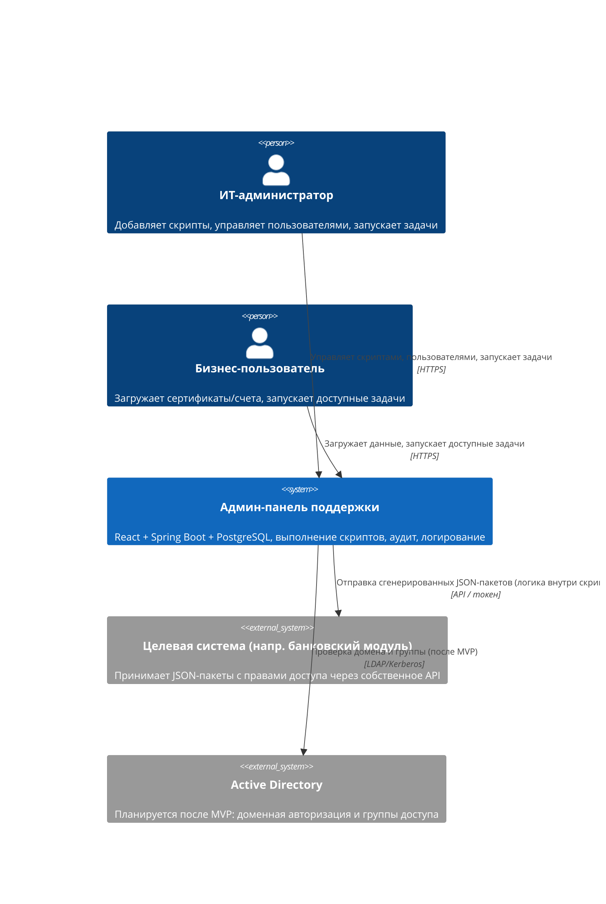
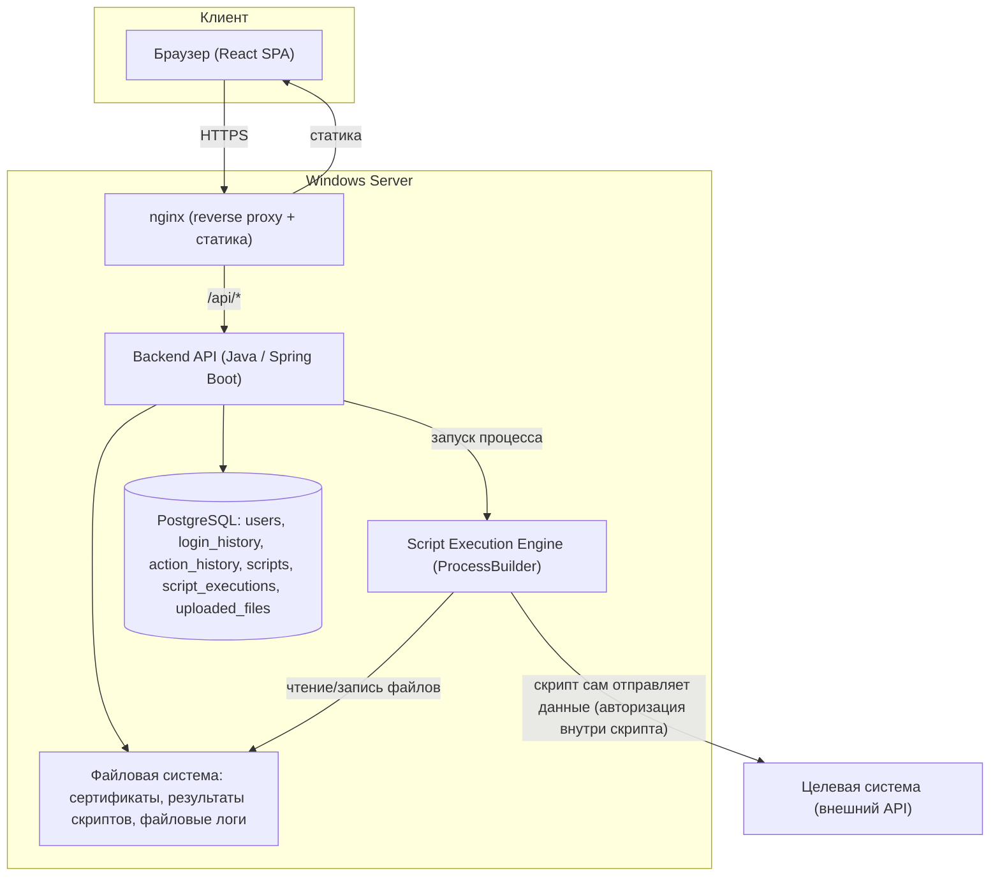
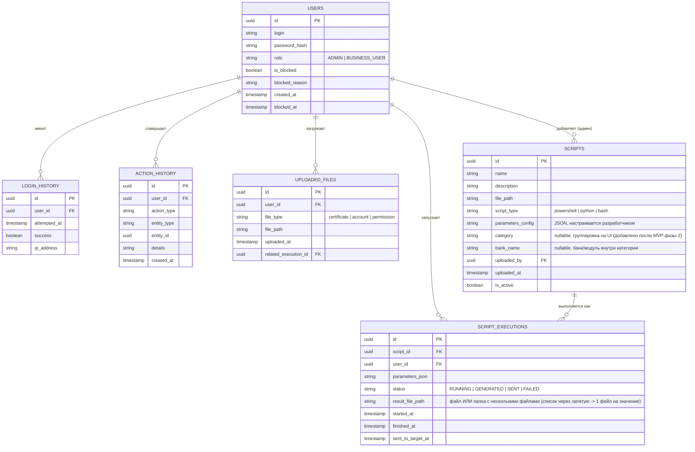

# High-Level Design: Админ-панель поддержки для запуска скриптов и самообслуживания бизнес-заказчиков

## 0. Статус реализации (актуализировано)

Этот раздел фиксирует, что было реализовано фактически и чем это отличается от
изначального плана ниже (разделы 1–12 остаются как исходный план/référence,
не переписаны целиком, чтобы сохранить историю решений).

**Реализовано и работает:**
- Все 4 фазы из раздела 10 (аутентификация, скрипты и выполнение, отправка и
  загрузка бизнес-данных, аудит и логирование).
- Реальные скрипты поддержки вместо демо-заглушки: 6 категорий "эталонных ролей"
  (ГРО, ГУП, Права просмотра, Валютный контроль Рубли/Валюта, SAP-PI) × до 7
  банков — все адаптированы под неинтерактивный запуск (PowerShell). Плюс
  отдельная категория "Генерация ЭЦП" (Python) — регистрация сертификатов для
  RaiffeisenBankApi.
- Множественная генерация файлов: если параметр допускает несколько значений
  через запятую (счета, ЭЦП), скрипт создаёт отдельный файл на каждое значение;
  скачивание отдаёт zip, если файлов больше одного (см. раздел 5, `download`).
- Общая история выполнений (`GET /api/executions`) — видно, кто/когда/что
  сгенерировал, доступна и скачивание всем авторизованным пользователям (не
  только владельцу/админу) — уточнение модели прав, см. раздел 8.
- Фирменное оформление СИБУР (цвета, лого) на фронтенде.
- Исправлен баг: при истёкшем/невалидном JWT backend по умолчанию отвечал 403
  вместо 401, из-за чего фронтенд не понимал, что нужно разлогинить пользователя,
  и страница зависала на "Загрузка...". Исправлено явным `authenticationEntryPoint`
  в `SecurityConfig`.

**Отличие от плана в разделе 7 ("Инфраструктура и деплой"):** вместо Backend как
Windows Service и отдельно установленных nginx/PostgreSQL — стенд развёрнут через
**Docker Compose** (3 контейнера: `web` (nginx + собранный frontend), `backend`,
`postgres`) одной командой (`deploy.bat` → `docker compose up --build -d`).
Backend собирается через Maven **внутри** Docker-образа без проблем. Frontend,
наоборот, собирается **вне** Docker (`vite build` внутри Docker на используемой
машине не работает — см. `README.md`) и раздаётся уже готовой статикой
(`frontend/dist-prebuilt/`) через однослойный nginx-образ.

**Не реализовано (осталось по плану вне MVP, см. раздел 9 и 11):** интеграция с
AD, автоматическая блокировка при подборе пароля, самообслуживание администратора
по настройке полей форм, CI/CD, мониторинг/алертинг, резервное копирование.

## 1. Обзор решения

Веб-приложение на базе Windows Server, состоящее из React-фронтенда (раздаётся через nginx), backend-сервиса на Java/Spring Boot и БД PostgreSQL. Backend выполняет PowerShell/Python/Bash скрипты локально на своей машине по запросу пользователя, сохраняет результат на диск и отображает статус в UI. Отправка сгенерированных данных во внешнюю целевую систему (банковский модуль) выполняется по отдельной команде пользователя ("Отправить") — логика авторизации и вызова внешнего API уже реализована внутри самих скриптов, backend лишь их запускает с параметрами. Система поддерживает две роли (Администратор, Бизнес-пользователь), ведёт аудит действий и историю авторизаций в БД, а также файловое логирование фронтенда с переключаемым уровнем детализации. MVP использует локальную авторизацию по логину/паролю (временное решение до перехода на AD).

## 2. Контекстная диаграмма (C4 — уровень Context)



## 3. Архитектура высокого уровня

### 3.1 Компоненты

| Компонент | Ответственность | Технология | Обоснование |
|---|---|---|---|
| Reverse proxy / статика | TLS-терминация, раздача React-сборки, проксирование `/api` на backend | nginx | Задано требованиями заказчика, стандарт для Windows-инфраструктуры |
| Frontend (SPA) | UI: список задач, формы запуска, статусы, история, логирование в файлы через backend | React | Выбор пользователя; интерактивный UI для форм и статусов |
| Backend API | Бизнес-логика, аутентификация (логин/пароль в MVP), ролевая модель, запуск скриптов, работа с БД, приём фронтенд-логов, запись на диск | Java 21 + Spring Boot 3.x | Задано требованиями заказчика; надёжное управление процессами (запуск скриптов), богатая экосистема безопасности |
| Script Execution Engine | Запуск PowerShell/Python/Bash скриптов как локальных процессов с переданными параметрами, перехват вывода и файлов результата | Встроено в backend (Java `ProcessBuilder`) | Скрипты выполняются на той же машине, что и backend — отдельный сервис не требуется |
| БД | Хранение пользователей, ролей, истории авторизаций, истории действий, метаданных файлов, метаданных скриптов | PostgreSQL 16 | Задано требованиями заказчика |
| Файловое хранилище | Хранение сертификатов, загруженных файлов, сгенерированных JSON/файлов результатов скриптов, файловых логов фронтенда | Локальная ФС Windows Server | Решение из SA-интервью: файлы на диске, в БД — только метаданные |
| Целевая система (внешняя) | Приём JSON-пакетов с правами доступа | Внешний API (вне периметра проекта) | Логика авторизации/отправки уже реализована внутри загружаемых скриптов |

### 3.2 Диаграмма компонентов (Mermaid)



### 3.3 Потоки данных

**Вход в систему (MVP):** Браузер → nginx → Backend проверяет логин/пароль (bcrypt) в PostgreSQL → при успехе выдаётся сессия/токен → фронтенд получает список задач согласно роли пользователя.

**Запуск скрипта:** Пользователь выбирает задачу и параметры в UI → Backend валидирует права доступа по роли → Backend запускает скрипт локальным процессом с параметрами → скрипт генерирует файл (например, JSON-пакет) на диск → Backend фиксирует статус выполнения и путь к файлу в `script_executions` → UI показывает статус "успешно/ошибка" и кнопку скачивания.

**Отправка в целевую систему:** Пользователь нажимает "Отправить" после проверки сгенерированного файла → Backend повторно запускает соответствующую часть скрипта (либо отдельный скрипт-отправитель) → скрипт сам выполняет доменную авторизацию, получает токен и отправляет JSON в целевую систему → результат (успех/ошибка) фиксируется в истории действий.

**Загрузка сертификатов/счетов бизнес-пользователем:** Пользователь загружает файл через UI → Backend сохраняет файл на диск, метаданные — в `uploaded_files` → событие фиксируется в `action_history`.

**Логирование фронтенда:** JS-код фронтенда формирует записи логов (уровень по умолчанию INFO, переключается администратором через настройки системы) → отправляются батчами на Backend (`POST /api/logs`) → Backend дописывает в файл на диске → ежедневная ротация, хранение 7 дней в активном виде, затем архивация.

## 4. Модель данных (верхнеуровневая)



## 5. API-контракты (верхнеуровневые)

| Метод | Путь | Роль | Назначение |
|---|---|---|---|
| POST | `/api/auth/login` | Все | Вход по логину/паролю, выдача JWT |
| GET | `/api/scripts` | Все | Список доступных задач согласно роли (с `category`/`bankName` для группировки на UI) |
| POST | `/api/scripts` | Admin | Загрузка нового скрипта (файл + метаданные) |
| PATCH | `/api/scripts/{id}` | Admin | Активировать/деактивировать скрипт |
| POST | `/api/scripts/{id}/execute` | Все (по правам) | Запуск скрипта с параметрами; при списке значений через запятую — один файл результата на каждое значение |
| GET | `/api/executions` | **Все авторизованные** | Общая история всех выполнений всех пользователей (кто/когда/что), для страницы "История" |
| GET | `/api/executions/mine` | Все | Только свои выполнения |
| GET | `/api/executions/{id}` | Все | Статус и метаданные выполнения |
| GET | `/api/executions/{id}/download` | **Все авторизованные** | Скачать результат: файл напрямую, либо zip-архив на лету, если файлов несколько |
| POST | `/api/executions/{id}/send` | Владелец выполнения / Admin | Отправить сгенерированные данные в целевую систему |
| POST | `/api/uploads` | Business User | Загрузка сертификата/счёта/полномочий |
| GET | `/api/users` | Admin | Список пользователей |
| POST | `/api/users` | Admin | Создание пользователя, назначение роли |
| POST | `/api/users/{id}/block` | Admin | Ручная блокировка |
| POST | `/api/users/{id}/unblock` | Admin | Разблокировка |
| GET | `/api/users/{id}/history` | Admin | История действий и авторизаций пользователя |
| GET | `/api/system/log-level` / `PUT /api/system/log-level` | Admin | Просмотр/переключение уровня логирования фронтенда |
| POST | `/api/logs` | Все | Приём батча логов от фронтенда, запись в файл |

**Изменение модели прав против первоначального плана:** просмотр и скачивание
результатов (`GET /api/executions`, `GET /api/executions/{id}/download`) открыты
любому авторизованному пользователю, а не только владельцу/админу — панель
общая для команды поддержки, сотрудники должны видеть и скачивать файлы друг
друга. Отправка в целевую систему (`POST /api/executions/{id}/send`) осталась
ограничена владельцем/админом.

## 6. Нефункциональные требования

| Категория | Требование | Целевой показатель | Примечание |
|---|---|---|---|
| Доступность | Работа 24/7 | Без формального SLA | Best-effort, без кластеризации в MVP |
| Производительность | Низкая нагрузка | До 10 пользователей, до 10 запусков скриптов/день | Не требует горизонтального масштабирования |
| Безопасность транспорта | Шифрование трафика | HTTPS обязателен везде | TLS-терминация на nginx |
| Безопасность хранения | Шифрование at rest | Не требуется | Достаточно ограничений доступа на уровне ФС/сети (внутренний контур) |
| Логирование | Файловые логи фронтенда | 4 уровня: INFO (по умолч.) / DEBUG / WARNING / TRACE, ротация 7 дней + архивация | Уровень переключается администратором в настройках системы |
| Аудит | Хранение истории действий и авторизаций | Бессрочно (MVP) | Политика хранения — открытый вопрос |
| Отказоустойчивость | Резервное копирование БД/файлов | Не требуется в MVP | [ASSUMPTION] Будет добавлено на следующем этапе |
| Мониторинг | Health-check, алертинг | Не требуется в MVP | Администратор реагирует по обращениям пользователей |

## 7. Инфраструктура и деплой

> **Фактически реализовано иначе, чем в первоначальном плане ниже** — см.
> раздел 0. Вместо Windows Service используется Docker Compose; текст ниже
> оставлен как исходный план для истории решения.

- **Целевая среда (план):** один Windows Server (текущая машина), на которой одновременно работают nginx, Backend (Java/Spring Boot как Windows-служба) и PostgreSQL.
- **Целевая среда (факт):** тот же Windows Server, но nginx (со встроенной статикой frontend), backend и PostgreSQL — три Docker-контейнера, поднимаемые `docker compose up --build -d` (обёрнуто в `deploy.bat`); требуется Docker Desktop.
- **Схема деплоя (план):** React собирается в статические файлы и копируется в каталог, раздаваемый nginx; Backend собирается в `.jar` и разворачивается как служба Windows (например, через NSSM); PostgreSQL — отдельная установленная служба на этом же сервере.
- **Схема деплоя (факт):** Backend собирается через Maven **внутри** Docker-образа (`backend/Dockerfile`, многоэтапная сборка) — проблем со сборкой нет. Frontend, наоборот, собирается **вне** Docker (`vite build` в Docker-контейнере на этой машине стабильно падает — конфликт esbuild/vite, похоже на локальную особенность окружения, не баг проекта) и раздаётся уже готовой статикой из `frontend/dist-prebuilt/` через однослойный nginx-образ; после изменений в `frontend/src/` статику нужно пересобрать вручную **до** `deploy.bat` (см. `README.md`).
- **CI/CD pipeline:** для MVP — ручной/скриптовой деплой (`deploy.bat` / `stop.bat` / `build_and_export.bat` — экспорт готовых образов для офлайн-переноса на другой ПК, см. `README-DEPLOY-OFFLINE.md`). Полноценный CI/CD — вне рамок MVP, потенциальное развитие проекта.
- **Мониторинг и алертинг:** не реализуются в MVP. [ASSUMPTION] На будущее — health-check эндпоинт (`/actuator/health` через Spring Boot Actuator, уже подключён и доступен без авторизации) как задел для последующего мониторинга.

## 8. Безопасность

- **Аутентификация (MVP):** логин/пароль, хранение хеша пароля через bcrypt в PostgreSQL. Это временное решение на период отладки.
- **Аутентификация (после MVP):** переход на доменную авторизацию (Active Directory), роль пользователя определяется принадлежностью к доменной группе (например, `SupportAdmins` → Администратор, `SupportBusinessUsers` → Бизнес-пользователь).
- **Авторизация:** ролевая модель на уровне backend (2 роли — Admin, Business User), проверка прав на каждый эндпоинт.
- **Блокировка пользователей:** ручная блокировка администратором в MVP; автоматическая блокировка при подборе пароля — вне MVP [ASSUMPTION: 5 неудачных попыток → блокировка на 15 минут, добавляется после интеграции с AD].
- **Шифрование:** обязательный HTTPS для всего трафика; шифрование файлов at rest не требуется, защита данных обеспечивается ограничением доступа на уровне ФС/сети.
- **Безопасность выполнения скриптов:** так как backend выполняет произвольные PowerShell/Python/Bash файлы с правами сервисной учётной записи, право на добавление скриптов — строго только у роли Admin. Рекомендуется дополнительно (вне кода, как процессная мера) вести ревью скриптов перед загрузкой в продакшн, поскольку технических ограничений на содержимое скрипта на уровне MVP не закладывается.
- **Compliance:** специфических требований (152-ФЗ, PCI DSS и т.п.) в рамках интервью не выявлено — открытый вопрос.

## 9. Риски и допущения

| # | Описание | Тип | Влияние | Митигация |
|---|---|---|---|---|
| 1 | MVP использует локальные логин/пароль вместо AD — при долгой эксплуатации MVP это риск несоответствия корпоративной политике безопасности | Risk | Среднее | Явно ограничить срок жизни MVP-аутентификации, запланировать переход на AD как приоритет следующего этапа |
| 2 | Backend выполняет произвольный код (скрипты) с правами сервисной учётной записи на сервере | Risk | Высокое | Ограничить право загрузки скриптов ролью Admin, процессное ревью скриптов, минимальные права сервисной учётной записи |
| 3 | Отсутствие резервного копирования БД и файлов в MVP | Risk | Среднее (при сбое диска — потеря аудита и сертификатов) | Запланировать backup-стратегию сразу после MVP |
| 4 | Один сервер без резервирования (backend, БД, nginx на одной машине) | Risk | Среднее (при отказе машины — полный простой) | Приемлемо при масштабе 10 пользователей и отсутствии формального SLA; пересмотреть при росте нагрузки |
| 5 | Точные значения версий стека (Java 21, Spring Boot 3.x, PostgreSQL 16) | Assumption | Низкое | Уточнить у заказчика при старте разработки, при необходимости скорректировать |
| 6 | Автоматическая блокировка (порог попыток, время) | Assumption | Низкое | Уточнить перед реализацией post-MVP функциональности |
| 7 | Архивация файловых логов (формат, срок хранения архива) | Assumption | Низкое | Уточнить при реализации модуля логирования |

## 10. План MVP-итерации

**Фаза 1 — Базовая инфраструктура и аутентификация**
- Деплой Windows Server + nginx + PostgreSQL + Spring Boot skeleton.
- Таблица `users`, логин/пароль (bcrypt), ролевая модель (Admin/Business User), ручное назначение ролей в БД.
- Ручная блокировка/разблокировка пользователя.
- Критерий готовности: пользователь может войти, роль определяет видимое меню.

**Фаза 2 — Управление скриптами и выполнение**
- Загрузка скриптов администратором через UI (`scripts`), запуск скрипта с параметрами (`script_executions`), сохранение результата на диск.
- UI: выпадающий список задач, форма параметров, статус "успешно/ошибка", скачивание результата.
- Критерий готовности: администратор может добавить скрипт и выполнить его, увидеть результат.

**Фаза 3 — Отправка в целевую систему и загрузка бизнес-данных**
- Кнопка "Отправить" (повторный запуск скрипта-отправителя после проверки файла).
- Загрузка сертификатов/счетов/полномочий бизнес-пользователем (`uploaded_files`).
- Критерий готовности: бизнес-пользователь может загрузить сертификат и запустить доступную ему задачу end-to-end.

**Фаза 4 — Аудит и логирование**
- История действий и авторизаций (`action_history`, `login_history`), отображение в UI для администратора.
- Файловое логирование фронтенда (4 уровня, переключение через настройки, ротация 7 дней + архив).
- Критерий готовности: администратор видит полную историю действий любого пользователя и может переключить уровень логирования.

## 11. Открытые вопросы

- Точный порог неудачных попыток входа и длительность блокировки при переходе к автоматической защите (после MVP).
- Состав и структура доменных групп для будущей интеграции с AD (группа X и другие).
- Детальный перечень типов документов/полномочий, которые сможет настраивать бизнес-пользователь при загрузке сертификатов/счетов.
- Политика хранения истории аудита (бессрочно или с ограничением по сроку).
- Наличие compliance-требований (например, 152-ФЗ при работе с персональными/финансовыми данными).
- Формат и место хранения архивных файловых логов, срок хранения архива.
- Стратегия резервного копирования БД и файлового хранилища (периодичность, место хранения).

## 12. Инструкции для AI-агента кодирования

**Приоритет реализации компонентов** (строго в этом порядке, каждая фаза должна быть рабочей и тестируемой перед переходом к следующей):
1. Backend skeleton (Spring Boot) + PostgreSQL schema (Flyway/Liquibase миграции) + аутентификация по логину/паролю (bcrypt) + ролевая модель (ADMIN, BUSINESS_USER).
2. CRUD для пользователей (создание, ручная блокировка/разблокировка, назначение роли) + `login_history`.
3. Управление скриптами: загрузка файла скрипта администратором, хранение метаданных, список доступных задач по роли.
4. Выполнение скриптов: запуск локального процесса (`ProcessBuilder`) с параметрами, перехват stdout/stderr и файла результата, запись в `script_executions`.
5. UI на React: страница логина, главная страница со списком задач (выпадающий список), форма запуска с параметрами, отображение статуса и кнопка скачивания результата.
6. Кнопка "Отправить" — повторный запуск/продолжение скрипта для передачи данных в целевую систему.
7. Загрузка файлов бизнес-пользователем (сертификаты/счета/полномочия) + `uploaded_files`.
8. `action_history` — запись значимых событий (логин, запуск скрипта, блокировка, загрузка файла, отправка) и отображение в UI для администратора.
9. Файловое логирование фронтенда: batched отправка логов на `/api/logs`, запись в файл на backend, настройка уровня логирования через `/api/system/log-level`, ротация 7 дней + архивация.

**Предпочтительный стек и версии:**
- Backend: Java 21 (LTS), Spring Boot 3.x, Spring Security, Spring Data JPA.
- БД: PostgreSQL 16, миграции через Flyway.
- Frontend: React (последняя стабильная), сборка через Vite, HTTP-клиент — стандартный `fetch` или axios.
- Веб-сервер: nginx (реверс-прокси + раздача статики).
- ОС: Windows Server (деплой Backend как Windows Service).

**Структура репозитория (предложение):**
```
/backend
  /src/main/java/.../controller
  /src/main/java/.../service
  /src/main/java/.../repository
  /src/main/java/.../entity
  /src/main/java/.../security
  /src/main/resources/db/migration   (Flyway)
  /src/main/resources/application.yml
/frontend
  /src/pages
  /src/components
  /src/api
/scripts
  /deploy   (bat/PowerShell скрипты сборки и деплоя)
/docs
  REFINED_VISION.md
  HLD.md
```

**Соглашения по коду:**
- Java: пакеты по слоям (controller/service/repository/entity), DTO отдельно от Entity, валидация входных параметров на уровне контроллера.
- Naming: таблицы БД — `snake_case`, Java-классы — `PascalCase`, REST-пути — `kebab-case`/`camelCase` в соответствии с таблицей раздела 5.
- Тесты: unit-тесты для сервисного слоя (JUnit 5 + Mockito), как минимум для логики запуска скриптов, блокировки пользователей и ролевых проверок доступа.
- Линтинг: Checkstyle или Spotless для Java; ESLint + Prettier для React.
- Все secrets (пароли БД, ключи) — через конфигурацию окружения (`application.yml` + переменные окружения), не хардкодить.

**Что НЕ нужно реализовывать (out of scope для MVP):**
- Интеграция с Active Directory / LDAP / Kerberos.
- Ролевая модель на основе доменных групп.
- Автоматическая блокировка при подборе пароля (brute-force protection).
- Самообслуживание администратора по настройке полей ввода параметров скрипта через UI (эта конфигурация — задача разработчика в коде).
- CI/CD pipeline (используется ручной/скриптовой деплой).
- Мониторинг, health-check, алертинг.
- Резервное копирование БД и файлового хранилища.
- Шифрование файлов at rest.
- Реализация логики авторизации/отправки в целевую систему на стороне backend — эта логика уже находится внутри загружаемых скриптов и не должна дублироваться.
